# 🗺️ ZeroThrow Ecosystem: World Domination Map

> A sprawling continent of chaos, now under the orderly reign of Result<T, E> and the penguin syndicate.

## 📊 Package Status Overview

### 🎯 Core Foundation
| Package | Version | Description | Status |
|---------|---------|-------------|--------|
| [`@zerothrow/core`](packages/core) | [](https://npm.im/@zerothrow/core) | Core Result<T,E> types and utilities | ✅ Published |

### 🛠️ Developer Toolkit
| Package | Version | Description | Status |
|---------|---------|-------------|--------|
| `@zerothrow/resilience` | - | Retry, circuit breaker, timeout patterns - NO THROW! | 🚧 In PR |
| `@zerothrow/expect` | - | Shared test matcher logic | 🚧 In Development |
| `@zerothrow/err-print` | - | Error formatting and display utilities | 📋 Planned |
| `@zerothrow/testing` | - | Unified testing utilities | 📋 Planned |
| `@zerothrow/eslint-plugin` | - | ESLint rules to enforce no-throw | 📋 Planned |
| `@zerothrow/dev-kit` | - | Complete developer toolkit bundle | 📋 Planned |

### 🧪 Test Runners
| Package | Version | Description | Status |
|---------|---------|-------------|--------|
| [`@zerothrow/jest`](packages/jest) | [](https://npm.im/@zerothrow/jest) | Jest matchers for Result types | ✅ Published |
| [`@zerothrow/vitest`](packages/vitest) | - | Vitest matchers for Result types | 🚧 In PR |
| `@zerothrow/cypress` | - | Cypress commands for Result types | 📋 Planned |
| `@zerothrow/playwright` | - | Playwright helpers for Result types | 📋 Planned |

### 🎨 UI Frameworks
| Package | Version | Description | Status |
|---------|---------|-------------|--------|
| `@zerothrow/react` | - | React hooks for Result types | 📋 Planned |
| `@zerothrow/vue` | - | Vue composables for Result types | 📋 Planned |
| `@zerothrow/svelte` | - | Svelte stores for Result types | 📋 Planned |

### 🌐 Platform Targets
| Package | Version | Description | Status |
|---------|---------|-------------|--------|
| `@zerothrow/node` | - | Node.js API wrappers returning Results | 📋 Planned |
| `@zerothrow/deno` | - | Deno-first implementation | 📋 Planned |
| `@zerothrow/browser` | - | Browser API wrappers | 📋 Planned |
| `@zerothrow/edge-runtime` | - | Generic edge runtime support | 📋 Planned |
| `@zerothrow/cloudflare` | - | Cloudflare Workers adapter | 📋 Planned |
| `@zerothrow/aws-lambda` | - | AWS Lambda handlers | 📋 Planned |

### 📝 Loggers
| Package | Version | Description | Status |
|---------|---------|-------------|--------|
| `@zerothrow/logger-winston` | - | Winston logger integration | 📋 Planned |
| `@zerothrow/logger-pino` | - | Pino logger integration | 📋 Planned |
| `@zerothrow/logger-bunyan` | - | Bunyan logger integration | 📋 Planned |

### 🤖 AI/ML & Database Integrations
| Package | Version | Description | Status |
|---------|---------|-------------|--------|
| `@zerothrow/openai` | - | OpenAI API with Results | 📋 Planned |
| `@zerothrow/langchain` | - | LangChain wrapped for safety | 📋 Planned |
| `@zerothrow/tfjs` | - | TensorFlow.js with no throws | 📋 Planned |
| `@zerothrow/prisma` | - | Prisma client wrapper | 📋 Planned |
| `@zerothrow/planetscale` | - | PlanetScale client wrapper | 📋 Planned |
| `@zerothrow/redis` | - | Redis operations that don't throw | 📋 Planned |

### 🌊 Web Frameworks (The Wild West)
| Package | Version | Description | Status |
|---------|---------|-------------|--------|
| `@zerothrow/express` | - | Express middleware and handlers | 📋 Planned |
| `@zerothrow/fastify` | - | Fastify plugin | 📋 Planned |
| `@zerothrow/koa` | - | Koa middleware | 📋 Planned |
| `@zerothrow/next` | - | Next.js integration | 📋 Planned |
| `@zerothrow/vite` | - | Vite plugin for transforms | 📋 Planned |
| `@zerothrow/runtime` | - | Runtime Result transformations | 📋 Planned |

## 🏗️ Architecture Overview



```mermaid
graph TB
  %% Core
  CORE["@zerothrow/core"]

  %% Developer Tools
  subgraph "DEV TOOLKIT"
    RESILIENCE["@zerothrow/resilience"]
    EXPECT["@zerothrow/expect"]
    PRINT["@zerothrow/err-print"]
    TESTING["@zerothrow/testing"]
    ESLINT["@zerothrow/eslint-plugin"]
    DEVKIT["@zerothrow/dev-kit"]
  end

  %% Test Frameworks
  subgraph "TEST RUNNERS"
    JEST["@zerothrow/jest"]
    VITEST["@zerothrow/vitest"]
    CYPRESS["@zerothrow/cypress"]
    PLAYWRIGHT["@zerothrow/playwright"]
  end

  %% UI Frameworks
  subgraph "UI"
    REACT["@zerothrow/react"]
    VUE["@zerothrow/vue"]
    SVELTE["@zerothrow/svelte"]
  end

  %% Cloud Platforms
  subgraph "PLATFORMS"
    NODE["@zerothrow/node"]
    DENO["@zerothrow/deno"]
    BROWSER["@zerothrow/browser"]
    EDGE["@zerothrow/edge-runtime"]
    WORKERS["@zerothrow/cloudflare"]
    AWS["@zerothrow/aws-lambda"]
  end

  %% Loggers
  subgraph "LOGGERS"
    WINSTON["@zerothrow/logger-winston"]
    PINO["@zerothrow/logger-pino"]
    BUNYAN["@zerothrow/logger-bunyan"]
  end

  %% AI/ML + DB
  subgraph "INTEGRATIONS"
    OPENAI["@zerothrow/openai"]
    LANGCHAIN["@zerothrow/langchain"]
    TENSOR["@zerothrow/tfjs"]
    PRISMA["@zerothrow/prisma"]
    PLANETSCALE["@zerothrow/planetscale"]
    REDIS["@zerothrow/redis"]
  end

  %% Legacy + Wild West
  subgraph "WILD WEST"
    EXPRESS["@zerothrow/express"]
    FASTIFY["@zerothrow/fastify"]
    KOA["@zerothrow/koa"]
    NEXT["@zerothrow/next"]
    VITE["@zerothrow/vite"]
    RUNTIME["@zerothrow/runtime"]
  end

  %% Connections
  CORE --> RESILIENCE
  CORE --> EXPECT
  CORE --> PRINT
  CORE --> ESLINT
  CORE --> NODE
  CORE --> DENO
  CORE --> BROWSER
  CORE --> EDGE
  CORE --> WORKERS

  EXPECT --> JEST
  EXPECT --> VITEST
  EXPECT --> CYPRESS
  EXPECT --> PLAYWRIGHT

  PRINT --> WINSTON
  PRINT --> PINO
  PRINT --> BUNYAN

  CORE --> REACT
  CORE --> VUE
  CORE --> SVELTE

  CORE --> OPENAI
  CORE --> PRISMA
  CORE --> REDIS
  CORE --> LANGCHAIN
  CORE --> PLANETSCALE
  CORE --> TENSOR

  CORE --> EXPRESS
  CORE --> FASTIFY
  CORE --> KOA
  CORE --> NEXT
  CORE --> VITE
  CORE --> RUNTIME

  DEVKIT --> TESTING
  TESTING --> EXPECT
  TESTING --> PRINT
  DEVKIT --> ESLINT
```

## 🚀 Release Phases

### Phase 1: Alpha Core (Current)
Focus on core functionality and essential developer tools:
- ✅ `@zerothrow/core` (v0.0.2-alpha)
- ✅ `@zerothrow/jest` (v0.0.1-alpha)
- 🚧 `@zerothrow/vitest`
- 🚧 `@zerothrow/expect`
- 📋 `@zerothrow/testing`
- 📋 `@zerothrow/err-print`

### Phase 2: Developer Experience
Enhanced tooling and popular framework support:
- `@zerothrow/eslint-plugin`
- `@zerothrow/react`
- `@zerothrow/node`
- `@zerothrow/logger-winston`
- `@zerothrow/logger-pino`
- `@zerothrow/dev-kit`

### Phase 3: Integration Layer
Connect with existing ecosystem:
- `@zerothrow/prisma`
- `@zerothrow/express`
- `@zerothrow/next`
- `@zerothrow/browser`
- `@zerothrow/openai`

### Phase 4: Ecosystem Domination
Complete platform coverage:
- All remaining UI frameworks
- All remaining test runners
- All platform targets
- AI/ML integrations
- Database adapters

## 💡 Package Examples

### @zerothrow/node
```typescript
import { readFile, writeFile } from '@zerothrow/node'

const result = await readFile("config.json", "utf-8")
  .map(JSON.parse)
  .andThen(validateConfig)
  .andThen(config => writeFile("output.json", JSON.stringify(config)))
```

### @zerothrow/openai
```typescript
import { createCompletion } from '@zerothrow/openai'

const response = await createCompletion({
  model: "gpt-4",
  prompt: "Hello, world!"
})
  .map(res => res.choices[0].text)
  .mapErr(err => new AIError('COMPLETION_FAILED', err))
```

### @zerothrow/react
```typescript
import { useResult } from '@zerothrow/react'

function UserProfile({ id }) {
  const userResult = useResult(() => fetchUser(id), [id])
  
  if (!userResult.ok) return <ErrorDisplay error={userResult.error} />
  if (userResult.loading) return <Skeleton />
  
  return <Profile user={userResult.value} />
}
```

### @zerothrow/cypress
```typescript
import { cyResult } from '@zerothrow/cypress'

cy.visit('/login')
  .then(cyResult(() => cy.get('#username').type('user')))
  .then(result => {
    if (!result.ok) {
      cy.log('Failed to find username field')
      return
    }
    // Continue with test
  })
```

## 🎯 Design Principles

1. **Zero Dependencies in Core** - The core package remains pure
2. **Consistent API** - All packages follow the same Result<T,E> pattern
3. **Progressive Enhancement** - Start with core, add packages as needed
4. **Framework Agnostic** - Adapters for everything, opinions for nothing
5. **Type Safety First** - Full TypeScript support with inference
6. **Performance Focused** - No throwing = no stack unwinding

## 📈 Success Metrics

- **Package Count**: 34 total packages planned
- **Coverage Goal**: Every major JS runtime, framework, and library
- **Adoption Target**: 1M weekly downloads within 2 years
- **Zero Throws**: Complete elimination of throw statements in adopting codebases

## 🐧 Theme

Penguins. Always penguins. Because penguins don't fly (throw), they slide (return) gracefully.

---

**"Exceptions fly; Results flow."** 🚀