# ZeroThrow Ecosystem

Welcome to the **ZeroThrow** ecosystem – a comprehensive suite of packages that bring Rust-style error handling to TypeScript.

## 📦 Published Packages

| Package | Version | Description | Status |
|---------|---------|-------------|--------|
| [`@zerothrow/core`](packages/core) | [](https://npm.im/@zerothrow/core) v0.2.1 | Core ZeroThrow functionality - Rust-style Result<T,E> for TypeScript | ✅ Published |
| [`@zerothrow/docker`](packages/docker) | [](https://npm.im/@zerothrow/docker) v0.1.1 | Zero-throw Docker utilities for testing and container management | ✅ Published |
| [`@zerothrow/expect`](packages/expect) | [](https://npm.im/@zerothrow/expect) v0.1.0 | Shared test matcher logic for ZeroThrow Result types | ✅ Published |
| [`@zerothrow/jest`](packages/jest) | [](https://npm.im/@zerothrow/jest) v1.0.2 | Jest matchers for ZeroThrow Result types | ✅ Published |
| [`@zerothrow/resilience`](packages/resilience) | [](https://npm.im/@zerothrow/resilience) v0.1.1 | Production-grade resilience patterns for ZeroThrow | ✅ Published |
| [`@zerothrow/testing`](packages/testing) | [](https://npm.im/@zerothrow/testing) v1.0.1 | Unified test matchers for ZeroThrow Result types - supports Jest and Vitest | ✅ Published |
| [`@zerothrow/vitest`](packages/vitest) | [](https://npm.im/@zerothrow/vitest) v1.0.2 | Vitest matchers for ZeroThrow Result types | ✅ Published |
| [`@zerothrow/zt-cli`](packages/zt-cli) | v0.1.1 | ZeroThrow CLI tool for repo-wide workflows | 🚧 Internal |

## 📦 Unpublished Packages (In Development)

| Package | Description | Status |
|---------|-------------|--------|
| [`@zerothrow/eslint-plugin`](packages/eslint-plugin) | ESLint rules to enforce no-throw discipline | 🚧 Development |
| [`@zerothrow/react`](packages/react) | React hooks and error boundaries for Result types | 🚧 Development |
| [`@zerothrow/logger-winston`](packages/logger-winston) | Winston logger integration with Result types | 🚧 Development |
| [`@zerothrow/logger-pino`](packages/logger-pino) | Pino logger integration with Result types | 🚧 Development |

## 🏗️ Architecture



```mermaid
graph TB
  %% Core
  CORE["@zerothrow/core"]

  %% Developer Tools
  ESLINT["@zerothrow/eslint-plugin"]
  JEST["@zerothrow/jest"]
  VITEST["@zerothrow/vitest"]
  EXPECT["@zerothrow/expect"]
  TESTING["@zerothrow/testing"]

  %% Integration Libraries
  REACT["@zerothrow/react"]
  RESILIENCE["@zerothrow/resilience"]
  DOCKER["@zerothrow/docker"]

  %% Logging
  WINSTON["@zerothrow/logger-winston"]
  PINO["@zerothrow/logger-pino"]
  PRINT["@zerothrow/err-print"]

  %% CLI Tools
  ZTCLI["@zerothrow/zt-cli"]

  %% Relationships
  JEST --> EXPECT
  VITEST --> EXPECT
  TESTING --> EXPECT
  REACT --> CORE
  RESILIENCE --> CORE
  DOCKER --> CORE
  WINSTON --> PRINT
  PINO --> PRINT
  TESTING --> PRINT
  ESLINT --> CORE
```

## 📚 Getting Started

### Quick Start

1. **Install the core package:**
   ```bash
   npm install @zerothrow/core
   ```

2. **Start using Result types:**
   ```typescript
   import { ZT } from '@zerothrow/core';
   
   const result = ZT.try(() => JSON.parse(userInput));
   
   result.match({
     ok: data => console.log('Parsed:', data),
     err: error => console.error('Failed:', error.message)
   });
   ```

3. **Add test matchers (optional):**
   ```bash
   npm install -D @zerothrow/jest  # or @zerothrow/vitest
   ```

4. **Add resilience patterns (optional):**
   ```bash
   npm install @zerothrow/resilience
   ```

## 🚀 Release Phases

### Phase 1: Core Foundation (Complete ✅)
Focus on core functionality and essential developer tools:
- ✅ `@zerothrow/core` (v0.2.1)
- ✅ `@zerothrow/jest` (v1.0.2)
- ✅ `@zerothrow/vitest` (v1.0.2)
- ✅ `@zerothrow/expect` (v0.1.0)
- ✅ `@zerothrow/testing` (v1.0.1)
- ✅ `@zerothrow/resilience` (v0.1.1)
- ✅ `@zerothrow/docker` (v0.1.1)

### Phase 2: Developer Experience
Enhanced tooling and popular framework support:
- 📋 `@zerothrow/react` - React hooks & error boundaries
- 📋 `@zerothrow/eslint-plugin` - Custom linting rules
- 📋 `@zerothrow/logger-winston` - Winston integration
- 📋 `@zerothrow/logger-pino` - Pino integration

### Phase 3: Enterprise Features
Production-ready features for large-scale applications:
- 📋 `@zerothrow/tracing` - OpenTelemetry integration
- 📋 `@zerothrow/graphql` - GraphQL error handling
- 📋 `@zerothrow/grpc` - gRPC error mapping
- 📋 `@zerothrow/validation` - Schema validation with Results

### Phase 4: Advanced Patterns
Sophisticated error handling patterns:
- 📋 `@zerothrow/async` - Advanced async patterns
- 📋 `@zerothrow/stream` - Stream processing with Results
- 📋 `@zerothrow/effect` - Effect system integration

## License

MIT © J. Kirby Ross