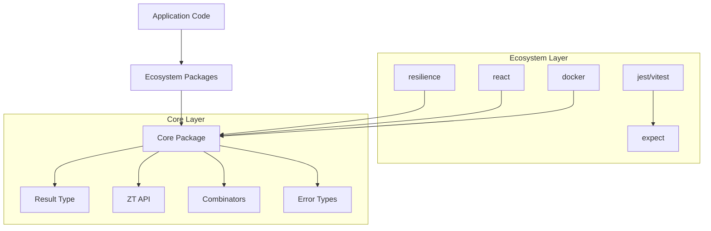

# ZeroThrow Architecture

This document describes the technical architecture of the ZeroThrow ecosystem, how packages fit together, and the key design patterns that enable type-safe error handling without exceptions.

## Table of Contents

- [Overview](#overview)
- [Core Architecture Principles](#core-architecture-principles)
  - [1. Zero Dependencies](#1-zero-dependencies)
  - [2. Layered API Design](#2-layered-api-design)
  - [3. Discriminated Union Pattern](#3-discriminated-union-pattern)
- [Package Architecture](#package-architecture)
  - [Core Package](#core-package-zerothrowcore)
  - [Resilience Package](#resilience-package-zerothrowresilience)
  - [Testing Packages](#testing-packages-zerothrowjest-zerothrowvitest)
  - [React Package](#react-package-zerothrowreact)
- [Key Architectural Patterns](#key-architectural-patterns)
  - [1. Factory Pattern](#1-factory-pattern)
  - [2. Fluent Interface](#2-fluent-interface)
  - [3. Strategy Pattern](#3-strategy-pattern)
  - [4. Decorator Pattern](#4-decorator-pattern)
  - [5. Clock Abstraction](#5-clock-abstraction)
- [Type System Architecture](#type-system-architecture)
  - [Generic Constraints](#generic-constraints)
  - [Type Guards](#type-guards)
  - [Contextual Error Types](#contextual-error-types)
- [Async Enhancement](#async-enhancement)
- [Debug and Observability](#debug-and-observability)
  - [Tracing](#tracing)
  - [Debug Mode](#debug-mode)
  - [Policy Events](#policy-events)
- [Performance Considerations](#performance-considerations)
  - [Object Allocation](#object-allocation)
  - [Monomorphic Code](#monomorphic-code)
  - [Fast Path Optimization](#fast-path-optimization)
- [Extension Points](#extension-points)
  - [Custom Policies](#custom-policies)
  - [Framework Integration](#framework-integration)
  - [Custom Matchers](#custom-matchers)
- [Future Architecture Considerations](#future-architecture-considerations)
  - [v0.3.0 Breaking Changes](#v030-breaking-changes)
  - [Planned Additions](#planned-additions)

## Overview

ZeroThrow implements a layered architecture inspired by functional programming and Rust's Result type, bringing explicit error handling to TypeScript while maintaining zero runtime dependencies.



## Core Architecture Principles

### 1. **Zero Dependencies**
Every package in the ecosystem maintains zero runtime dependencies. This architectural constraint ensures:
- Minimal bundle size impact
- No transitive dependency conflicts
- Predictable runtime behavior
- Easy adoption in any TypeScript project

### 2. **Layered API Design**
The core package exposes multiple API surfaces for different use cases:

```typescript
// Layer 1: ZT Pocket Knife - Daily driver API
import { ZT } from '@zerothrow/core';
ZT.try(() => risky());
ZT.ok(value);
ZT.err('ERROR_CODE');

// Layer 2: Result Type - Object-oriented fluent API
import { Result } from '@zerothrow/core';
result
  .map(transform)
  .andThen(validate)
  .unwrapOr(fallback);

// Layer 3: ZeroThrow Namespace - Functional utilities
import { ZeroThrow } from '@zerothrow/core';
ZeroThrow.collect([result1, result2]);
ZeroThrow.pipe(fn1, fn2, fn3);
```

### 3. **Discriminated Union Pattern**
The Result type is implemented as a discriminated union, enabling exhaustive pattern matching and type-safe error handling:

```typescript
type Result<T, E extends Error> = Ok<T> | Err<E>;

interface Ok<T> {
  ok: true;
  value: T;
  // ... methods
}

interface Err<E extends Error> {
  ok: false;
  error: E;
  // ... methods
}
```

## Package Architecture

### Core Package ([`@zerothrow/core`](../packages/core))

The foundation of the ecosystem, providing:

```
packages/core/src/
├── index.ts              # Main entry point
├── core-exports.ts       # Single source of truth for exports
├── result.ts            # Result<T,E> type and factory
├── error.ts             # ZeroError with code/message/context
├── combinators.ts       # Functional utilities
├── zt-pocket-knife.ts   # Convenience API
├── debug.ts             # Debug and tracing utilities
└── types.ts             # Type definitions
```

**Key Design Decisions:**
- Result objects have methods attached via factory pattern
- Error normalization ensures all errors extend Error
- Fluent API enables method chaining
- Type guards provide compile-time safety

### Resilience Package ([`@zerothrow/resilience`](../packages/resilience))

Implements production-grade fault tolerance patterns:

```
packages/resilience/src/
├── policies/
│   ├── base.ts          # Abstract base policy
│   ├── retry.ts         # Retry with backoff
│   ├── circuit-breaker.ts # Circuit breaker pattern
│   ├── timeout.ts       # Timeout enforcement
│   └── ...              # Other policies
├── errors/              # Policy-specific errors
├── clock.ts             # Clock abstraction for testing
└── index.ts             # Public API
```

**Policy Architecture:**
- Abstract `BasePolicy` class provides common functionality
- Each policy implements `execute(operation)` method
- Policies compose via wrapping (decorator pattern)
- Clock abstraction enables deterministic testing

### Testing Packages ([`@zerothrow/jest`](../packages/jest), [`@zerothrow/vitest`](../packages/vitest))

Share common matcher logic via [`@zerothrow/expect`](../packages/expect):

```
packages/expect/src/
├── matchers.ts          # Core matcher implementations
├── types.ts             # Matcher type definitions
└── index.ts             # Public API

packages/jest/src/
├── index.ts             # Jest-specific wrapper
└── matchers.ts          # Jest integration

packages/vitest/src/
├── index.ts             # Vitest-specific wrapper
└── matchers.ts          # Vitest integration
```

### React Package ([`@zerothrow/react`](../packages/react))

Provides React-specific utilities:

```
packages/react/src/
├── hooks/
│   ├── useResult.ts     # Result state management
│   └── useResilientResult.ts # With retry/resilience
├── components/
│   └── ResultBoundary.tsx # Error boundary for Results
├── context.ts           # Result context utilities
└── index.ts             # Public API + re-exports
```

## Key Architectural Patterns

### 1. **Factory Pattern**
Results are created via factory functions that attach methods to plain objects:

```typescript
function createResult<T, E extends Error>(
  base: { ok: true; value: T } | { ok: false; error: E }
): Result<T, E> {
  // Attach methods to base object
  return Object.assign(base, {
    map: (fn) => base.ok ? createOk(fn(base.value)) : base,
    andThen: (fn) => base.ok ? fn(base.value) : base,
    // ... other methods
  });
}
```

### 2. **Fluent Interface**
All Result methods return Results, enabling intuitive chaining:

```typescript
fetchUser(id)
  .map(user => user.profile)
  .andThen(profile => validateProfile(profile))
  .tap(profile => log('Valid profile:', profile))
  .tapErr(error => log('Invalid profile:', error))
  .unwrapOr(defaultProfile);
```

### 3. **Strategy Pattern**
Resilience policies implement different failure handling strategies:

```typescript
abstract class BasePolicy {
  abstract execute<T>(operation: () => Promise<T>): Promise<Result<T, Error>>;
}

class RetryPolicy extends BasePolicy {
  execute<T>(operation: () => Promise<T>): Promise<Result<T, Error>> {
    // Retry logic implementation
  }
}
```

### 4. **Decorator Pattern**
Policies compose by wrapping other policies:

```typescript
const resilient = PolicyFactory.compose(
  new RetryPolicy({ attempts: 3 }),
  new CircuitBreakerPolicy({ threshold: 5 }),
  new TimeoutPolicy({ timeout: 5000 })
);
// Execution order: Retry → Circuit Breaker → Timeout → Operation
```

### 5. **Clock Abstraction**
Enables deterministic testing of time-dependent operations:

```typescript
interface Clock {
  now(): number;
  setTimeout(fn: () => void, ms: number): any;
  clearTimeout(id: any): void;
}

// Production uses SystemClock
// Tests use TestClock for control
```

## Type System Architecture

### Generic Constraints
All error types must extend Error for type safety:

```typescript
interface Result<T, E extends Error> {
  // Ensures E is always an Error subtype
}
```

### Type Guards
Enable TypeScript's control flow analysis:

```typescript
function isOk<T, E extends Error>(result: Result<T, E>): result is Ok<T> {
  return result.ok === true;
}

if (isOk(result)) {
  // TypeScript knows result.value exists here
}
```

### Contextual Error Types
Errors carry typed context for debugging:

```typescript
class ZeroError<TCode extends string = string> extends Error {
  constructor(
    public code: TCode,
    message: string,
    public options?: {
      cause?: Error;
      context?: Record<string, unknown>;
    }
  ) {
    super(message);
  }
}
```

## Async Enhancement

The `Async<T, E>` interface extends Promise with Result methods:

```typescript
interface Async<T, E extends Error> extends Promise<Result<T, E>> {
  map<U>(fn: (value: T) => U): Async<U, E>;
  andThen<U, E2>(fn: (value: T) => Result<U, E2>): Async<U, E | E2>;
  // ... other Result methods
}
```

This enables async operations to use the same fluent API:

```typescript
await fetchUser(id)
  .map(user => user.email)
  .andThen(email => sendEmail(email))
  .unwrapOr('sent');
```

## Debug and Observability

### Tracing
Built-in tracing for debugging Result chains:

```typescript
result
  .trace('after-fetch')    // [after-fetch] Result.Ok: { ... }
  .map(transform)
  .trace('after-transform') // [after-transform] Result.Err: Error ...
```

### Debug Mode
Conditional debug execution with zero overhead when disabled:

```typescript
ZT.debug.enable();
ZT.debug('api', 'Fetching user', userId);
ZT.debug.do(() => {
  console.log('Debug mode only');
});
```

### Policy Events
Resilience policies emit events for monitoring:

```typescript
policy.on('retry', ({ attempt, error }) => {
  metrics.increment('retry.attempt', { attempt });
});
```

## Performance Considerations

### Object Allocation
- Result creation reuses prototype methods (no per-instance allocation)
- Combinators avoid unnecessary object creation where possible
- Error path is optimized (93× faster than throw/catch)

### Monomorphic Code
- Single Result shape for JIT optimization
- Consistent property access patterns
- No dynamic property addition

### Fast Path Optimization
Resilience policies check success before applying policy logic:

```typescript
async execute(operation: () => Promise<T>) {
  // Try operation first without policy overhead
  const result = await ZT.tryAsync(operation);
  if (result.ok) return result;
  
  // Only apply policy logic on failure
  return this.executeWithPolicy(operation);
}
```

## Extension Points

### Custom Policies
New resilience patterns can be added by extending BasePolicy:

```typescript
class CustomPolicy extends BasePolicy {
  async execute<T>(operation: () => Promise<T>): Promise<Result<T, Error>> {
    // Custom fault tolerance logic
  }
}
```

### Framework Integration
New framework integrations follow the pattern:
1. Depend only on `@zerothrow/core`
2. Provide framework-idiomatic API
3. Re-export core for convenience
4. Maintain zero dependencies principle

### Custom Matchers
Testing frameworks can add custom matchers via the expect package:

```typescript
import { createMatchers } from '@zerothrow/expect';

const matchers = createMatchers({
  // Framework-specific implementation
});
```

## Future Architecture Considerations

### v0.3.0 Breaking Changes
- ErrorCode standardization (enum-based codes)
- Removal of all `any` types
- Enhanced error tracing utilities
- Performance optimizations via shared prototypes

### Planned Additions
- Bulkhead isolation policy
- Hedge policy for latency optimization
- Conditional policy routing
- Enhanced async utilities

The architecture is designed to evolve while maintaining backwards compatibility within major versions and preserving the core principles of explicit error handling, zero dependencies, and excellent developer experience.