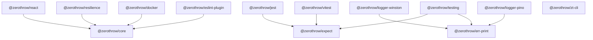

```mermaid
graph TB
  %% Core
  CORE["@zerothrow/core"]

  %% Developer Tools
  ESLINT["@zerothrow/eslint-plugin"]
  JEST["@zerothrow/jest"]
  VITEST["@zerothrow/vitest"]
  EXPECT["@zerothrow/expect"]
  TESTING["@zerothrow/testing"]

  %% Integration Libraries
  REACT["@zerothrow/react"]
  RESILIENCE["@zerothrow/resilience"]
  DOCKER["@zerothrow/docker"]

  %% Logging
  WINSTON["@zerothrow/logger-winston"]
  PINO["@zerothrow/logger-pino"]
  PRINT["@zerothrow/err-print"]

  %% CLI Tools
  ZTCLI["@zerothrow/zt-cli"]

  %% Relationships
  JEST --> EXPECT
  VITEST --> EXPECT
  TESTING --> EXPECT
  REACT --> CORE
  RESILIENCE --> CORE
  DOCKER --> CORE
  WINSTON --> PRINT
  PINO --> PRINT
  TESTING --> PRINT
  ESLINT --> CORE
```